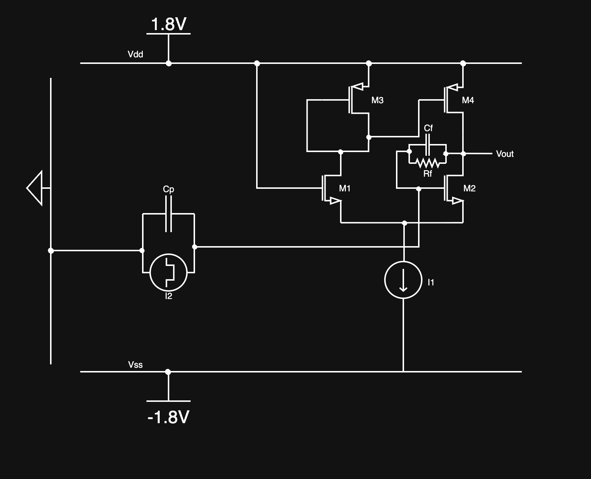
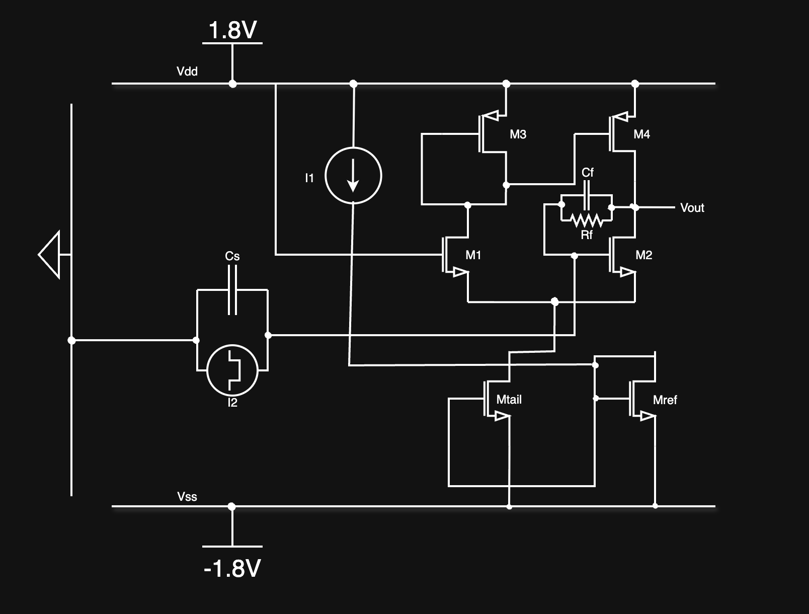

# Cryo-CMOS Charge-Sensitive Amplifier for Quantum-Sensor Readout

<p align="center">
  <a href="https://doi.org/10.5281/zenodo.21064438">
    
  </a>
</p>

---

## Abstract

This repository presents an open-source simulation study of a **cryogenic CMOS charge-sensitive amplifier (CSA)** designed for semiconductor quantum-sensor readout.

A compact **five-transistor operational transconductance amplifier (OTA)** topology is evaluated under two configurations:

* An **ideal tail current source** (baseline)
* A **physically realizable NMOS current-mirror bias**

The system is characterized across extreme temperatures, from **300 K (27°C)** down to **77 K** and **5 K**, capturing the behavioral transition of CMOS analog front-ends in cryogenic regimes.

This repository provides the **complete LTspice simulation workspace and architectural schematics**.

---

## Core Principle

The CSA converts input charge into a voltage through a feedback capacitor:

```
V_out = Q_in / C_f
```

For a MOS-based OTA:

```
g_m ≈ 2 * I_D / V_ov
```

where:

* `g_m` = transconductance
* `I_D` = drain current
* `V_ov = V_GS - V_TH` = overdrive voltage

At cryogenic temperatures:

* Carrier mobility increases
* Threshold voltage shifts
* Bias stability becomes non-ideal

These effects directly influence gain, linearity, and transient response.

---

## System Architecture

<p align="center">
  
</p>

<p align="center">
  <em>Figure 1: CSA with ideal tail current source (baseline configuration).</em>
</p>

<p align="center">
  
</p>

<p align="center">
  <em>Figure 2: CSA with NMOS current-mirror tail bias (physically realizable configuration).</em>
</p>

Both schematics implement a **five-transistor OTA-based charge-sensitive amplifier**, differing only in their tail biasing strategy.

* The **ideal configuration** isolates intrinsic amplifier behavior
* The **current-mirror configuration** introduces realistic bias dependencies

Full circuit-level details are available in the LTspice files.

---

## What Was Explored

* Cryogenic behavior of CMOS analog front-ends
* Stability of OTA biasing at low temperatures
* Impact of tail current realization on amplifier response
* Differences between idealized and physically realizable biasing
* Temperature-dependent variations in gain and transient characteristics

---

## Repository Structure

```text
cryo-csa-readout/
├── README.md
├── LICENSE
├── schematics/
│   ├── csa-ideal.png
│   └── csa-current-mirror.png
└── spice/
    ├── csa-frontend-Ideal.asc
    └── csa-frontend-CM.asc
```

---

## Usage

Open the LTspice schematics:

* `csa-frontend-Ideal.asc`
* `csa-frontend-CM.asc`

Run simulations using `.op`, `.tran`, and temperature sweeps:

```
.temp 300 77 5
```

Modify input charge, bias conditions, and feedback parameters to explore system behavior.

---

## Citation

If you use this work in research, please cite:

> Selvakumar, S. (2026). *Cryo-CMOS Charge-Sensitive Amplifier for Quantum-Sensor Readout*. Zenodo. https://doi.org/10.5281/zenodo.21064438

---

## License

This project is released under the **MIT License**.

---

## Notes

This repository is intentionally minimal in explanation.

The focus is on:

* Clean architecture
* Reproducible simulation
* Direct access to circuit-level behavior

Users are encouraged to explore the LTspice files for full insight into the system.

---
